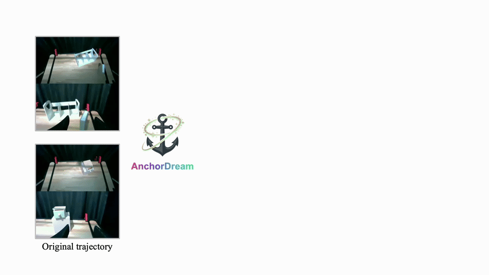

<div align="center">

#  AnchorDream: Repurposing Video Diffusion for Embodiment-Aware Robot Data Synthesis

[**Junjie Ye**](https://junjieye.com/)<sup>1,2</sup> · [**Rong Xue**](https://rongxuezoe.github.io/)<sup>2</sup> · [**Basile Van Hoorick**](https://basile.be/)<sup>1</sup> \
[**Pavel Tokmakov**](https://pvtokmakov.github.io/home/)<sup>1</sup> · [**Muhammad Zubair Irshad**](https://zubairirshad.com/)<sup>1</sup> · [**Yue Wang**](https://yuewang.xyz/)<sup>2</sup> · [**Vitor Guizilini**](https://vitorguizilini.github.io/)<sup>1</sup>

<sup>1</sup>Toyota Research Institute 
<br> 
<sup>2</sup>Physical SuperIntelligence Lab, University of Southern California 

<a href='https://arxiv.org/abs/2512.11797'></a>
<a href='https://junjieye.com/AnchorDream/'></a>
[](https://opensource.org/licenses/Apache-2.0)

</div>

<div align="center">
  
</div>


## Overview

This is the official code release for [AnchorDream](https://arxiv.org/abs/2512.11797), accepted to **ICRA 2026**.

AnchorDream grounds video diffusion models in robot motion to produce embodiment-consistent data that boosts imitation learning. By fine-tuning a video world model ([NVIDIA Cosmos-Predict2](https://github.com/nvidia-cosmos/cosmos-predict2)) with trajectory conditioning, it turns a robot-only (anchor) video into realistic multi-view observations, enabling scalable data augmentation for policy learning. AnchorDream yields **36.4% relative gains** on RoboCasa and nearly **doubles** real-world policy performance.

## Setup

### 1. Clone and set environment variables

```bash
git clone https://github.com/Jay-Ye/AnchorDream.git anchordream && cd anchordream
cp .env.sample .env      # then edit: HF_TOKEN, WANDB_*, CKPT_DIR, DATA_DIR
```

`CKPT_DIR` / `DATA_DIR` point to where checkpoints and datasets live on the host; they are mounted into the container at `/workspace/checkpoints` and `/workspace/datasets`.

### 2. Build and launch the Docker container

```bash
bash custom/shell/build_docker.sh   # build the image (all deps are baked in)
bash custom/shell/run_docker.sh     # loads .env, mounts CKPT_DIR/DATA_DIR, starts the container
```

All Python/apt dependencies are baked into the image (`requirements-docker.txt` + `Dockerfile`); there is no separate install step inside the container.

### 3. Download checkpoints

Inside the container (`huggingface-cli` is available):

```bash
# NVIDIA Cosmos-Predict2 2B Video2World base model
huggingface-cli download nvidia/Cosmos-Predict2-2B-Video2World --local-dir ${CKPT_DIR}/nvidia/Cosmos-Predict2-2B-Video2World

# T5 text encoder
huggingface-cli download google-t5/t5-11b --local-dir ${CKPT_DIR}/google-t5/t5-11b

# AnchorDream fine-tuned LoRA weights (model.pt + config.yaml)
huggingface-cli download Jay-Ye/AnchorDream-RoboCasa --local-dir ${CKPT_DIR}/anchordream-robocasa
```

## Data

AnchorDream conditions on **robot-only (anchor) videos**, which are not part of the original RoboCasa release — they are produced by replaying trajectories with segmentation. You have two options.

**Option A (recommended): download our processed data.** 24 tasks × {`human`, `mg`} = 48 HDF5 files, all containing robot-only videos. The `mg` files additionally contain AnchorDream-generated observations under the `*_image_generated_vanilla_189` keys.

```bash
huggingface-cli download Jay-Ye/AnchorDream-RoboCasa-HDF5 --repo-type dataset --local-dir ${DATA_DIR}/raw/RoboCasa
```

The files follow the original RoboCasa layout:
```
${DATA_DIR}/raw/RoboCasa/datasets/v0.1/single_stage/
  {category}/{Task}/{date}/demo_gentex_im128_randcams_im128.hdf5         # human (24)
  {category}/{Task}/mg/{date}/demo_gentex_im128_randcams_im128.hdf5      # mg, with generated obs (24)
```

**Option B: start from original RoboCasa and replay yourself.** This uses our customized RoboCasa fork, which adds segmentation masks to the replay observations so robot-only videos can be rendered. First set up the conda environment following [`doc/robocasa_robomimic_setup.md`](doc/robocasa_robomimic_setup.md), then, from the `robocasa/` repo:

```bash
conda activate robocasa
# download the original RoboCasa datasets (24 tasks, human + mg)
python -m robocasa.scripts.download_datasets --ds_types human_im mg_im   # [--tasks OpenDrawer ...]
# replay the trajectories with segmentation to render robot-only videos
python -m custom.replay_with_segmentation     --ds_types human_im mg_im   # [--tasks OpenDrawer ...]
```

## Generate Observations

Use the AnchorDream LoRA weights to turn robot-only videos + trajectories into multi-view observations, written into the `mg` HDF5 files under `{camera}_image_generated_<save_suffix>` keys.

> If you used Option A above, these observations (`vanilla_189`) are already present in the `mg` files — you can skip this section.

Generate for all 24 RoboCasa tasks:
```bash
bash custom/shell/run_posttrained_to_gen_obs_robocasa.sh
```

Or run a single task:
```bash
torchrun --nproc_per_node=4 --master_port=12346 -m examples.traj_video2world_robocasa \
    --num_gpus 4 \
    --model_size 2B \
    --dit_path "${CKPT_DIR}/anchordream-robocasa/model.pt" \
    --is_lora_trained \
    --training_config_path "${CKPT_DIR}/anchordream-robocasa/config.yaml" \
    --traj_embedder_type vanilla \
    --resolution 256 --aspect_ratio 1,1 \
    --robocasa_hdf5_path "path/to/demo_gentex_im128_randcams_im128.hdf5" \
    --num_conditional_frames 5 \
    --disable_guardrail --disable_prompt_refiner \
    --save_suffix "vanilla_189"
```

## Train AnchorDream

We train on `human` demos (~50 per task). First convert the HDF5 files into the per-episode format used by the video-model dataloader, then compute T5 embeddings.

**Step 1 — convert HDF5 to the processed dataset format:**
```bash
python data_processing/robocasa/hdf5_to_dataset.py \
    --local_base_dir ${DATA_DIR}/raw/RoboCasa \
    --output_dir ${DATA_DIR}/RoboCasa
```
This uses the segmentation maps in the HDF5 to render robot-only masked videos and extracts per-episode data:
```
${DATA_DIR}/RoboCasa/
  {Task}/
    episode_list.txt
    metas/task_description.txt
    t5_xxl/*.pickle
    human/demo_0/
      rgb/multiview_video.mp4                 # ground-truth multi-view video
      rgb_sim_rollout_masked/multiview_video.mp4  # robot-only (anchor) video
      lowdim/lowdim.pkl                       # end-effector trajectory
```

**Step 2 — generate T5 text embeddings:**
```bash
python -m scripts.get_t5_embeddings_from_robocasa --dataset_path ${DATA_DIR}/RoboCasa
```

**Step 3 — fine-tune Cosmos-Predict2 2B with trajectory-conditioned LoRA:**
```bash
EXP=traj_conditioned_predict2_video2world_2b_training_robocasa
torchrun --nproc_per_node=8 --master_port=12341 -m scripts.train \
    --config=cosmos_predict2/configs/base/config.py -- experiment=${EXP} \
    model.config.pipe_config.net.traj_emb_config.type=vanilla \
    model.config.pipe_config.net.traj_emb_config.input_dim=10
```

Key training settings:
- **Frames:** 189
- **Trajectory embedder:** vanilla (linear projection), `input_dim=10` (pos3 + quat4 + gripper2 + indicator1)
- **Architecture:** LoRA fine-tuning of the 2B Video2World model

Checkpoints are written under `${CKPT_DIR}/cosmos_predict2/<group>/<name>/checkpoints/` (override the output root with `IMAGINAIRE_OUTPUT_ROOT`).

## Policy Learning & Evaluation

Once observations are generated (downloaded or self-generated), train and evaluate
imitation-learning policies in the conda environment from
[`doc/robocasa_robomimic_setup.md`](doc/robocasa_robomimic_setup.md).

**Generate the training configs.** The config generator resolves the dataset paths from
your local RoboCasa install and sets the `rgb_suffix` that selects the AnchorDream-generated
observations:

```bash
conda activate robocasa
cd robomimic
python robomimic/scripts/config_gen/bc_xfmr_gen.py
# writes two variants and prints their paths:
#   mix_50human_300gen — 50 human demos + 300 AnchorDream-generated observations
#                        (reads the *_image_generated_vanilla_189 keys from the mg HDF5)
#   mix_50human_300mg  — 50 human demos + 300 MimicGen observations (baseline)
```

Then train with a generated config:

```bash
python robomimic/scripts/train.py --config <path printed above, e.g. .../seed_123_ds_mix_50human_300gen.json>
```

Evaluation is a two-step rollout: generate an eval config from a trained checkpoint, then
run it with `--eval_only`.

```bash
# 1) build an eval config from a trained checkpoint
python robomimic/scripts/config_gen/eval_ckpt.py \
    --ckpt path/to/expdata/.../models/model_epoch_1000.pth \
    --name seed_123_ds_human-50
# 2) run the rollout evaluation on the generated config
CUDA_VISIBLE_DEVICES=0 python robomimic/scripts/train.py \
    --config path/to/autogen_configs/.../seed_123_ds_ckpt_datasets.json \
    --eval_only
```

## Training with Custom Data (Piper Example)

To demonstrate training on your own robot data, we include the Piper real-world robot pipeline. See `data_processing/pipper/` for data preparation and `examples/traj_video2world_piper.py` for inference.

```bash
# Piper training (368x368, 93 frames)
EXP=traj_conditioned_predict2_video2world_2b_training_piper
torchrun --nproc_per_node=8 --master_port=12341 -m scripts.train \
    --config=cosmos_predict2/configs/base/config.py -- experiment=${EXP} \
    model.config.pipe_config.net.traj_emb_config.type=vanilla \
    model.config.pipe_config.net.traj_emb_config.input_dim=9 \
    model.config.pipe_config.state_t=22
```

### Custom Dataset Format

To train on your own robot data, prepare it in this structure:
```
datasets/YourDataset/
  {TaskName}/
    episode_list.txt          # List of episode paths (one per line)
    t5_xxl/*.pickle           # Pre-computed T5 embeddings for task descriptions
    {episode_id}/
      rgb/multiview_video.mp4 # Concatenated multi-view video
      rgb_sim_rollout_masked/multiview_video.mp4 # Robot-only masked videos (same structure)
      lowdim/lowdim.pkl       # Trajectory dict with robot state arrays
```

The `lowdim.pkl` should contain numpy arrays of the robot end-effector trajectory (position + orientation + gripper state).

## Citation

```bibtex
@inproceedings{ye2026anchordream,
  title={AnchorDream: Repurposing Video Diffusion for Embodiment-Aware Robot Data Synthesis},
  author={Ye, Junjie and Xue, Rong and Van Hoorick, Basile and Tokmakov, Pavel and Irshad, Muhammad Zubair and Wang, Yue and Guizilini, Vitor},
  booktitle={IEEE International Conference on Robotics and Automation (ICRA)},
  year={2026}
}
```

## Acknowledgements

- [NVIDIA Cosmos-Predict2](https://github.com/nvidia-cosmos/cosmos-predict2) — base video world model
- [RoboCasa](https://robocasa.ai/) — simulation benchmark for kitchen manipulation

## License

This project is licensed under the Apache License 2.0 — see [LICENSE](LICENSE) for details.
